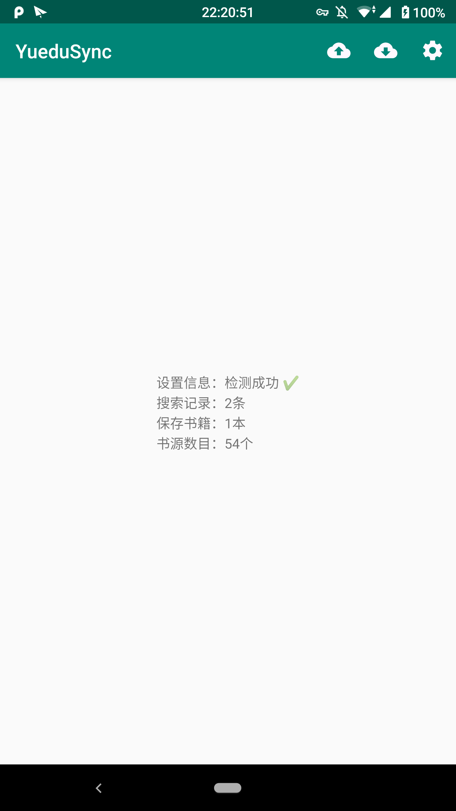

## 「阅读」同步工具
利用坚果云的 WebDav 功能实现一个简单的用户配置备份/还原功能，旨在尝试一下 WebDav 的操作。

### 使用方法
- 启动软件，授予权限，填写你的坚果云用户名以及应用密码（可以自行新建）后即可进行备份与还原。（如果你改变了阅读的备份位置，亦可以在设置中手动选择备份目录的路径）
- 若不懂如何设置 WebDav 则可以一定程度上参考 https://writer.drakeet.com/backups （此文来自于「纯纯写作」作者 Drakeet ，万分感谢。）

### 软件截图

